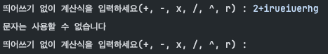
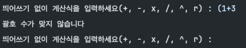
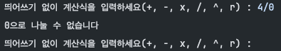
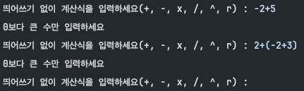
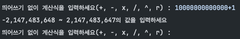
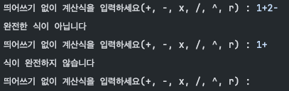
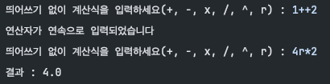

[프로젝트 개요]

### Lv 1. 클래스 없이 기본적인 연산을 수행할 수 있는 계산기 만들기

- [ ]  **양의 정수(0 포함)를 입력받기**
    - [ ]  Scanner를 사용하여 양의 정수 2개(0 포함)를 전달 받을 수 있습니다.
    - [ ]  양의 정수는 각각 하나씩 전달 받습니다.
    - [ ]  양의 정수는 적합한 타입으로 선언한 변수에 저장합니다.
- [ ]  **사칙연산 기호(➕,➖,✖️,➗)를 입력받기**
    - [ ]  Scanner를 사용하여 사칙연산 기호를 전달 받을 수 있습니다.
    - [ ]  사칙연산 기호를 적합한 타입으로 선언한 변수에 저장합니다. (`charAt(0)`)
- [ ]  **위에서 입력받은 양의 정수 2개와 사칙연산 기호를 사용하여 연산을 진행한 후 결과값을 출력하기**
    - [ ]  키워드 : `if` `switch`
    - [ ]  사칙연산 기호에 맞는 연산자를 사용하여 연산을 진행합니다.
    - [ ]  입력받은 연산 기호를 구분하기 위해 제어문을 사용합니다. (예를 들면 if, switch)
    - [ ]  연산 오류가 발생할 경우 해당 오류에 대한 내용을 정제하여 출력합니다.
        - [ ]  ex) “나눗셈 연산에서 분모(두번째 정수)에 0이 입력될 수 없습니다.“
- [ ]  **반복문을 사용하되, 반복의 종료를 알려주는 “exit” 문자열을 입력하기 전까지 무한으로 계산을 진행할 수 있도록 소스 코드를 수정하기**
    - [ ]  키워드 : 무한으로 반복, 수정하기 (처음부터 무한 반복하는 것이 아니라, 위 스텝별로 진행하며 수정)
    - [ ]  반복문을 사용합니다. (예를 들어, for, while…)

### Lv 2. 클래스를 적용해 기본적인 연산을 수행할 수 있는 계산기 만들기

- [ ]  사칙연산을 수행 후, 결과값 반환 메서드 구현 & 연산 결과를 저장하는 컬렉션 타입 필드를 가진 Calculator 클래스를 생성
    - [ ]  사칙연산을 수행한 후, 결과값을 반환하는 메서드 구현
    - [ ]  연산 결과를 저장하는 컬렉션 타입 필드를 가진 Calculator 클래스를 생성
    - [ ]  1) 양의 정수 2개(0 포함)와 연산 기호를 매개변수로 받아 사칙연산(➕,➖,✖️,➗) 기능을 수행한 후 2) 결과 값을 반환하는 메서드와 연산 결과를 저장하는 컬렉션 타입 필드를 가진 Calculator 클래스를 생성합니다.
- [ ]  **Lv 1에서 구현한 App 클래스의 main 메서드에 Calculator 클래스가 활용될 수 있도록 수정**
    - [ ]  연산 수행 역할은 Calculator 클래스가 담당
        - [ ]  연산 결과는 Calculator 클래스의 연산 결과를 저장하는 필드에 저장
    - [ ]  소스 코드 수정 후에도 수정 전의 기능들이 반드시 똑같이 동작해야합니다.
- [ ]  **App 클래스의 main 메서드에서 Calculator 클래스의 연산 결과를 저장하고 있는 컬렉션 필드에 직접 접근하지 못하도록 수정 (캡슐화)**
    - [ ]  간접 접근을 통해 필드에 접근하여 **가져올** 수 있도록 구현합니다. (Getter 메서드)
    - [ ]  간접 접근을 통해 필드에 접근하여 **수정할** 수 있도록 구현합니다. (Setter 메서드)
    - [ ]  위 요구사항을 모두 구현 했다면 App 클래스의 main 메서드에서 위에서 구현한 메서드를 활용 해봅니다.
- [ ]  Calculator 클래스에 저장된 연산 결과들 중 가장 먼저 저장된 데이터를 삭제하는 기능을 가진 메서드를 구현한 후 App 클래스의 main 메서드에 삭제 메서드가 활용될 수 있도록 수정
    - [ ]  키워드 : `컬렉션`
        - [ ]  컬렉션에서 ‘값을 넣고 제거하는 방법을 이해한다.’가 중요합니다!

[프로젝트 소개]

필수 기능 레벨 2까지 구현 후 입력-엔터를 반복해야 하는 번거로움과 괄호를 사용하고 싶어 후위표기식을 이용하여 구현한 계산기

후위 표기식이란 연산자를 연산 대상의 뒤에 쓰는 표기법으로 왼쪽부터 순서대로 계산할 수 있어서 컴퓨터에게 시킬 수식으로 적합하다

ex) (1+2)x3 -> 12+3x

후위표기식 참고 : https://woongsios.tistory.com/288

[프로젝트 기능]

- 괄호, 제곱(^), 제곱근(r) 사용
- 계산하고 싶은 식을 문자열 형태로 입력하여 계산 ex) 2*(1+3)^2r
:
- 계산 끝난 시점과 계산식 입력 도중 'exit'로 프로그램 종료
- 기록 조회, 맨 처음 데이터 삭제, 모두 삭제 기능 추가
:

[예외처리]

1. 숫자와 연산자를 제외한 값 입력 시 다시 입력

2. 괄호 짝 맞지 않을 때 다시 입력

3. 0으로 나누려고 하면 다시 입력

4. 음수 입력 시 다시 입력(빼기 연산자와 같아서 맨 앞과 괄호 다음만 확인)

5. int형 범위애서만 입력 가능하도록 예외처리 

6. 정확한 계산식이 아닐 경우 다시 입력 ex) 1+2-

7. 연산자 연속 입력 예외처리 ex) 1++2
- 'r'연산자는 뒤에 연산자가 올 수 있어서 한번 더 얘외처리

[실행화면]

