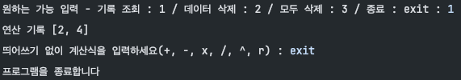

필수 기능 레벨2 까지 구현 후 입력-엔터를 반복해야하는 번거로움과 괄호를 사용하고 싶어서 구현한 계산기

- 괄호, 제곱(^), 재곱근(r) 사용
- 계산하고 싶은 식을 문자열 형태로 입력하여 계산 ex) 2*(1+3)^2r
:
- 계산 끝난 시점과 계산식 입력 도중 'exit'로 프로그램 종료
- 기록조회, 맨 처음 데이터 삭제, 모두 삭제 기능 추가
:

- 예외처리
1. 숫자와 연산자를 제외한 값 입력 시 다시 입력
2. 괄호 짝 맞지 않을 때 다시 입력
3. 0으로 나누려고 하면 다시 입력
4. 음수 입력 시 다시 입력(빼기 연산자와 같아서 맨 앞과 괄호 다음만 확인)
5. int형 범위애서만 입력 가능하도록 예외처리 
6. 정확한 계산식이 아닐 경우 다시 입력 ex) 1+
7. 연산자 연속 입력 예외처리 ex) 1++2

실행화면

